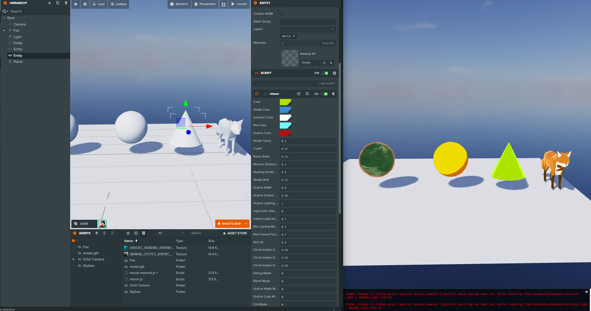

# PlayCanvas MToon Material 

## How to Use
### Engine Only 
1. Install:

```bash
npm install playcanvas-mtoon-material-test
```

2. Usage example:

```javascript
import MToonMaterial from "playcanvas-mtoon-material-test"

const material = new MToonMaterial(); // Create a new material 
material._Color = new Color(1, 0, 0); // Set the color of the material
```

### PlayCanvas Editor

1. Fork [this project](https://playcanvas.com/project/1242264/).
2. Add the material to your project.



## Building

If you want to develop this project locally, you can build it using the following steps:

1. Clone the repository:
   ```bash
   git clone https://github.com/yushimatenjin/playcanvas-mtoon-material.git
   ```

2. Install dependencies:
   ```bash
   npm install
   ```

3. Run the build:
   ```bash
   npm run build
   ```

## Testing

To run the tests, use the following command:

```bash
npm test
```

## Supported Properties

Here's a list of currently supported properties:

### Basic Properties

- _Color: Color
- _EmissionColor: Color
- _ShadeColor: Color
- _RimColor: Color
- _OutlineColor: Color
-  matcapFactor: Color

### Textures

- _BumpMap: Texture | null
- _EmissionMap: Texture | null
- _MainTex: Texture | null
- _OutlineWidthTexture: Texture | null
- _ShadeTexture: Texture | null
- _SphereAdd: Texture | null
- rimMultiplyTexture: Texture | null
- uvAnimationMaskTexture: Texture | null

### Numeric Properties

- _Cutoff: number
- _BumpScale: number
- _ReceiveShadowRate: number
- _ShadingGradeRate: number
- _ShadeShift: number
- _ShadeToony: number
- _LightColorAttenuation: number
- _IndirectLightIntensity: number
- _RimLightingMix: number
- _RimFresnelPower: number
- _RimLift: number
- giEqualizationFactor: number
### Outline Related

- _OutlineWidth: number
- _OutlineScaledMaxDistance: number
- _OutlineLightingMix: number
- _OutlineWidthMode: number
- _OutlineColorMode: number
- _OutlineCullMode: number

### UV Animation

- _UvAnimScrollX: number
- _UvAnimScrollY: number
- _UvAnimRotation: number

### Rendering Settings

- _BlendMode: number
- _CullMode: number
- _SrcBlend: number
- _DstBlend: number
- _ZWrite: number

